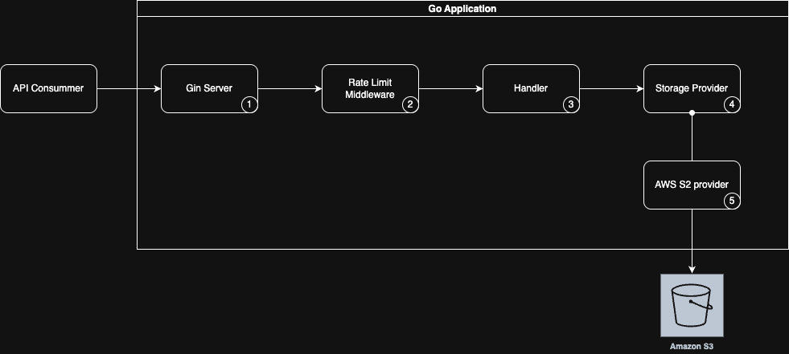

# File Upload API with Resume Capability

A Go-based API for handling large file uploads with resumable support, leveraging cloud storage (currently AWS S3) in a provider-agnostic architecture.

---

## 🚀 Features

- Multipart uploads for large files
- Upload resumption for interrupted sessions
- Pluggable cloud storage backend (default: AWS S3)

### 🧩 Why Multipart Upload?
Multipart upload is a critical design choice for handling large files efficiently. Here’s why it was chosen:

🔄 Resumability, 
Multipart uploads allow clients to resume interrupted uploads by re-sending only the failed part(s), rather than restarting the entire process. This is especially valuable for users on unstable networks.

📦 Efficient Memory & Bandwidth Usage
Files are split into smaller parts, which reduces memory overhead on the client and server. It also enables parallel uploads to maximize throughput and reduce total upload time.

⚙️ Built-In Cloud Support
Cloud providers like AWS S3 natively support multipart uploads, offering optimized handling of each part, automatic checksums, and server-side assembly of the final object.

🧱 Scalability
Large files no longer block server threads or memory. This approach makes it easier to scale the API under high load or with many concurrent users.

🛠 Fault Tolerance
If a part fails to upload due to a network glitch or server error, only that specific part needs to be retried — improving reliability and user experience.

💾 Upload Flexibility
Multipart design enables clients to Upload parts out of order, retry individual parts and  adjust part sizes dynamically based on file size or network conditions


---

## 🧱 Architecture Overview



This API is implemented in **Go**, chosen for its simplicity, performance, low memory footprint, and suitability for cloud-native applications.

### 🧩 Components

1. **Gin HTTP Server**  
   Chosen for its performance, low overhead, and ease of use.

2. **Rate Limiter Middleware**  
   Custom middleware ([`internal/middleware/rate_limiter.go`](internal/middleware/rate_limiter.go)) to prevent abuse and ensure fair usage by limiting requests per IP.

3. **Upload Handler**  
   Business logic for managing multipart uploads ([`internal/handler/upload.go`](internal/handler/upload.go)), including validation and delegation to the storage provider.


4. **Storage Provider Interface**  
   Defines a standard interface for any storage backend ([`internal/storage/storage.go`](internal/storage/storage.go)), enabling provider-agnostic implementation.

5. **AWS S3 Provider**  
   Default implementation for AWS S3 ([`internal/storage/s3_provider.go`](internal/storage/s3_provider.go)).

---

### ☁️ Why Cloud Storage? Why AWS S3?

Cloud storage offers benefits such as scalability, durability, and security. While multiple providers (AWS, Azure, GCP) offer similar capabilities, **AWS S3** was selected based on developer familiarity and its wide support. The **S3 Standard** tier was chosen as it fits the general-purpose file upload use case.

---

## 🛠️ Deployment


The API is deployed using **AWS App Runner**, offering:

- **Automatic Scaling**  
  Seamless autoscaling based on traffic and resource usage.

- **Built-in Load Balancing**  
  Ensures high availability and low latency.

- **Git Integration**  
  Supports deployment from GitHub, Bitbucket, and Amazon ECR.

---

## 🧪 Local Setup

### 1. Install dependencies
```bash
go mod download
```

### 2. Set environment variables
```bash
export AWS_BUCKET_NAME=your-bucket-name
export AWS_REGION=your-aws-region
export AWS_ACCESS_KEY_ID=your-access-key
export AWS_SECRET_ACCESS_KEY=your-secret-key
export PORT=8080 # Optional, default is 8080
export RATE_LIMIT=10 # Optional, default requests per second per IP
```

---

## 📡 API Endpoints

OpenAPI Specification: [`api/openapi.yaml`](api/openapi.yaml)

### 1. Initiate Upload
Start a new multipart upload session.
```http
POST /upload/initiate
Headers:
- X-File-Name: string (required)
- X-Total-Parts: number (required)

Response:
{
  "upload_id": "string",
  "key": "string"
}
```

### 2. Upload Part
Upload a single part of the file.
```http
POST /upload/part
Headers:
- X-Upload-ID: string (required)
- X-Part-Number: number (required)

Body: Binary file chunk

Response:
{
  "part_number": number,
  "etag": "string"
}
```

### 3. Complete Upload
Finalize the multipart upload process.
```http
POST /upload/complete
Headers:
- X-Upload-ID: string (required)

Response:
{
  "message": "Upload completed successfully",
  "key": "string"
}
```

### 4. Health Check
```http
GET /health-check
```

---

## 📘 Example Usage

### 1. Initiate Upload
```bash
curl -X POST   -H "X-File-Name: large-file.zip"   -H "X-Total-Parts: 3"   http://localhost:8080/upload/initiate
```

### 2. Upload Parts
```bash
curl -X POST   -H "X-Upload-ID: {upload_id}"   -H "X-Part-Number: 1"   --data-binary "@part1"   http://localhost:8080/upload/part
```

### 3. Complete Upload
```bash
curl -X POST   -H "X-Upload-ID: {upload_id}"   http://localhost:8080/upload/complete
```

---

## ❌ Error Handling

The API returns meaningful HTTP status codes:

| Code | Meaning |
|------|---------|
| 400  | Bad Request – Missing or invalid headers |
| 404  | Not Found – Upload ID not found |
| 429  | Too Many Requests – Rate limit exceeded |
| 500  | Internal Server Error – Storage or server failure |

---

## 🧑‍💻 Development

To start the server locally:
```bash
go run cmd/api/main.go
```

---

## 📦 Dependencies

- [`github.com/aws/aws-sdk-go-v2`](https://github.com/aws/aws-sdk-go-v2) — AWS SDK for Go
- [`github.com/gin-gonic/gin`](https://github.com/gin-gonic/gin) — HTTP web framework
- [`github.com/google/uuid`](https://github.com/google/uuid) — UUID generation

## 🧭 Next Steps

The current implementation serves as a robust foundation for handling large file uploads with resume support. Here are some potential enhancements to further improve scalability, security, and usability:


### 🌐🔐 1. API Gateway Integration + OAuth
Deploy the API behind a managed API Gateway (such as AWS API Gateway) to:
- Allow integration with Authentication providers (e.g., AWS Cognito)

### 🧾 2. Audit Logging
Record key events (upload start, part received, completion) to an audit log for traceability and debugging.

### 📦 3. Support for Additional Storage Providers
Expand the provider interface to support:
- Google Cloud Storage
- Azure Blob Storage
- Local or on-premise storage (for hybrid solutions)
